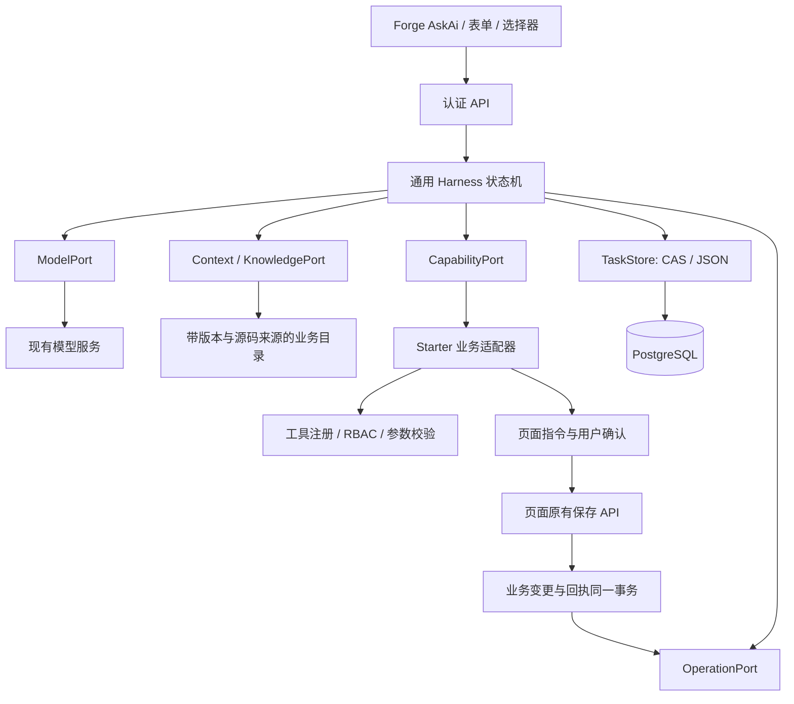

# Ask AI Harness v1

Starter 是唯一开发、设计和验收基准。通用核心先在 Starter 验证，再把同一版本接入数据集 `main`、`yiliao` 的业务适配器。

## 架构决定

采用无框架的轻量运行时。模型负责理解与选择工具；运行时负责状态、暂停、恢复、并发和执行边界。现有业务 service、权限与事务回执继续作为权威，不复制第二套 CRUD。



| 边界 | 接口与责任 |
| --- | --- |
| `types.ts / engine.ts` | JSON 协议、8 步上限、90 秒截止、会话版本 CAS、暂停与结构化回复；不引用 Next、Drizzle、账号、模型 SDK 或 Forge |
| `model.next` | 统一消息和工具调用；模型 ID、服务地址和密钥由服务端模型适配器解析 |
| `capabilities.list/invoke` | 读取、页面操作、写入提案三个效果；权限、参数与记录校验留在业务适配器 |
| `context.resolve` | 当前页、允许的结构化业务契约和检索事实；不是授权来源 |
| `TaskStore` | 创建、归属查询、CAS 更新、最近 20 个会话；`postgres-store.ts` 是可替换实现 |
| `operations.retire` | 新目标或取消使待执行提案失效；实际写库由现有页面 API 事务完成 |
| `presentation.finalize` | 持久化模型标签、建议等应用展示数据；核心不理解 UI block |
| `AskAiHarness` | 仅渲染协议：候选、指定目标、取消、状态与处理记录；账号表单仍是业务组件 |

不引入额外 agent 框架或向量库依赖。端口允许以后更换模型、存储或检索实现，当前规模下可以直接审查状态转移和 SQL 事务。

## 状态与调用协议

状态：`running → waiting-user / waiting-external / completed / failed`；取消进入 `cancelled`。用户新目标推进同一个会话，但清除旧待办的授权。处理记录只保存工具与状态事件，不保存模型思维链。

`POST /api/ask-ai/` 在原字段外接收：

```json
{
  "question": "打开一个模型详情",
  "harness": {
    "requestId": "UUID",
    "runId": "已有会话 UUID，可省略",
    "expectedRevision": 6,
    "reply": { "interactionId": "待答交互 ID", "optionId": "已登记候选 ID" }
  }
}
```

- 首次请求 ID 同时作为 run ID，响应丢失也能重试；每个新输入用新的 requestId。
- 选择/自定义输入/取消通过 `reply` 传递。允许其 question 为空。服务端保存候选 ID，不从 assistant 文案解析序号。
- 模型使用 `tool_choice=auto`：普通聊天、写作与有足够查询依据后的回答直接输出正文，通过 SSE `delta.content` 实时送入客户端。业务事实按需查询，真实对象选择用 `ask_user`；组件由 `assistant_present` 按表达需要选择，不默认展示上下文或分析步骤。旧 `respond` 会话仍可恢复，新请求不再向模型暴露它。
- 查询与展示分开：成功查询记录在本轮服务端 observation 中，模型收到来源调用编号与真实结果。表格由服务端从该来源组装，忽略模型填入的记录；图表要求有效来源且数值存在于查询结果。无法验证的计算改用文字说明。这些约束验证来源和数值，不构成模型语义正确率保证。写入仍须原有签名提案、页面确认及保存回执。
- 一次只允许一个写者；重复的当前 requestId 返回原结果，旧 revision 返回 409。客户端恢复最新状态，不盲目重放。
- 每轮重新计算权限；能力集合或部署版本改变，旧会话不可复用。列表也过滤不兼容会话。
- 每次最多 8 个模型步骤，80 条历史消息；90 秒有运行时截止时间，120 秒以内租约回收。中断的工具调用在下一请求前清理，避免无结果的调用历史导致模型连续报错。
- `GET /api/ask-ai/runs/` 恢复当前用户最近 20 个会话。历史页面指令仅展示，不重放。恢复保存使用服务器 operation 回执，而非客户端宣称。
- `GET /api/ask-ai/?page=/models/` 返回当前页面、当前权限下的建议。

## 操作可靠性

1. read 直接查询；page 直接发已登记页面指令，浏览器等路由/页面 ack 后显示成功。
2. proposal 生成小表单或操作预览，停在 waiting-external。模型没有数据库写入口。
3. 签名确认单绑定 owner、run、request、记录版本和页面上下文。一个提案使用同一个 operation ID。
4. 页面最终保存时，先锁任务，再锁 operation；检查任务仍在等待此提案。业务变更与回执在同一事务提交。
5. 取消或换目标使旧确认和旧页面 operation 失效。客户端只关闭同一 session/operation 的助手草稿，保留手动草稿。
6. 保存续办先验证 operation 归属、任务绑定、已提交状态，再读回最终记录；模型收到真实保存结果，继续核对/导出。丢响应重试返回原结果，不重放写入。

候选只来自本目标的实际查询。已完成旧目标中的选择不能授权新目标。多个匹配必须明确选择，列表浏览本身可直接返回结果。
指定名称、用户名或 ID 只有在当前真实候选中精确且唯一匹配才放行；重名继续选择，后一次回复覆盖旧选择。结构化输出约束能防止漏渲染交互，不保证模型的语义判断永远正确，需持续用真实模型样例回归。

## 代码与业务知识

三类事实各自维护：

- **结构契约**：`lib/semantic/contracts.ts` 的页面、字段、动作；工具 schema 来自业务参数校验。
- **代码索引**：现有 `pnpm semantic build` 建立源码锚点与依赖关系；源指纹随部署绑定。在线助手不扫描源码、不把仓库文件发送给模型。
- **业务解释**：`starter-knowledge.ts` 的 10 条审阅说明，带 source path/symbol/version、前置条件和后续建议；按应用、build、权限、字符预算检索。

当前业务解释是经过源码核对的登记目录，不是全仓自动生成知识库。以后扩展自动抽取或语义检索，仍需满足 source/version/permission 协议，不能把推断当已验证事实。动态记录由工具实时读取，不放入静态知识目录。

## 接入一个新业务

1. 在业务自己的 `agent.ts` 注册只读能力和写入提案，复用 service/schema/RBAC。
2. 在平台适配器中声明效果、页面入口、确认与回执读回方式；补来源明确的业务规则。
3. 界面复用 AskAiHarness；新增领域表单由该业务单独提供。
4. 用该领域测试数据验证查询→选择→提案→页面保存→回执续办。不得修改 engine 增加资源名判断。

`tests/harness/engine.test.ts` 使用独立 tickets 适配器跑通该链路，作为核心通用性门禁。Starter 首批接入账号查询/新增/修改/删除/导出、模型查询/筛选/打开、角色/菜单/权限读取与说明。

## 本地启动与迁移

- PostgreSQL 是持久化前提；demo 登录不替代数据库。
- 新库按正常 `pnpm db:push` 创建 schema。已有库在指定数据库应用 `migrations/0003_ask_ai_harness.sql`（要求已存在 semantic-v1 operation 表）；这是新增表/可空列迁移。
- 启用 `SEMANTIC_ENABLED=true`，确保页面保存走版本/幂等/回执链路。
- `ASK_AI_HARNESS_ENABLED` 默认启用，false 为停止接收新 harness 操作的开关。不要静默退回旧意图规则并声称具有持久化能力。
- 在模型服务中启用支持工具调用的模型，或设置服务端 ASK_AI_LLM_*。取消待办不需要模型调用。
- 部署时先迁移，再发布同一 build 的服务端和客户端。本阶段仅 Starter 本地验证；其他两个分支等待基准验收后接入。

## 验证与限制

```sh
pnpm check
SEMANTIC_HTTP_ORIGIN=http://127.0.0.1:3167 node scripts/semantic-test-env.mjs \
  node --import tsx --test --test-concurrency=1 tests/harness/*.test.ts tests/semantic/*.test.ts tests/navigation/*.test.ts
```

隔离数据库测试强制 localhost + forge_semantic_test_* 名称。HTTP 测试临时注册自己的本地假模型并清理，不修改现有模型；真实模型另通过 Chrome 验证。

覆盖：纯核心、知识来源/权限/预算、真实 PostgreSQL、JSON/HTTP 往返、竞争 CAS、重复请求、取消、旧按钮、记录版本、用户/应用隔离、保存读回、断线续办。UI 审计见 `ask-ai-harness-ui-audit.md`。

当前采用请求内执行和租约，不是后台作业队列；页面写入仍需人确认保存。运行中刷新可恢复检查点，但不会自动重放尚无回执的工具。长任务、跨会话记忆、全仓代码生成不在 v1 的已实现能力中。

本地验收：137 项自动测试通过；真实 Qwen 改写 3/3 通过，Chrome 已点通候选、指定目标、刷新恢复、页面确认/保存回读/取消和详情导航。新增数据库迁移仅应用到隔离测试库。分发前先验收 Starter，随后各平台适配自身业务能力。
