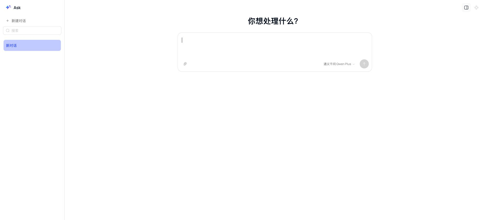
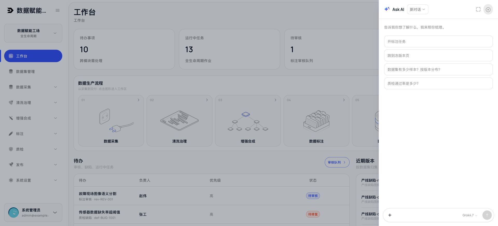
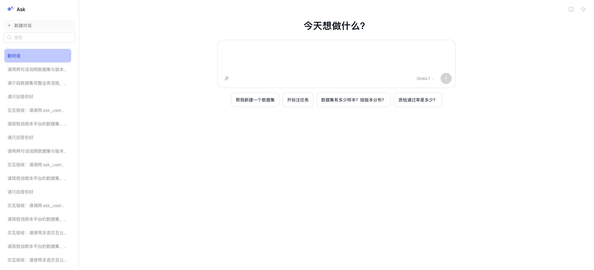
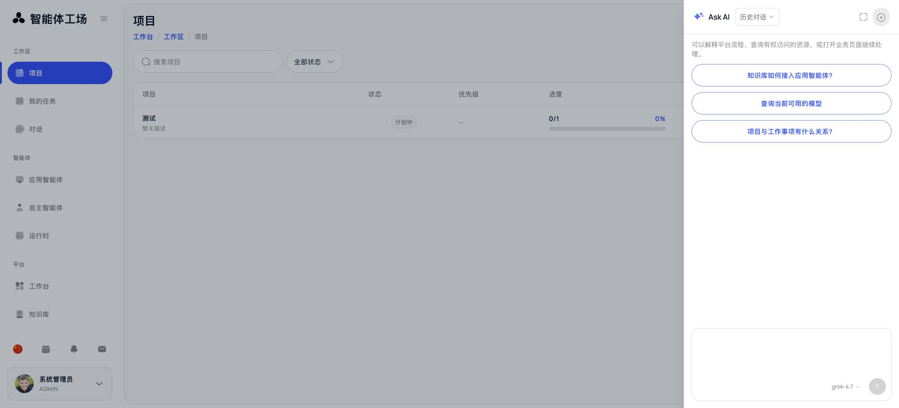

# Ask AI 占位提示清空验证（2026-10-10）

## 范围与对照

只修改 AskAi / PromptBar 的 placeholder 属性及其共享常量，显式传空字符串，避免 Kit 回退到默认文案。保留输入框外的标题、建议问题和说明，以及所有已有未提交修改。

角色：宿主工作台/列表中的共享助手，不新增业务页面。宿主页头 chrome 保持原样；助手沿用 Kit AskAi、PromptBar 的抽屉和全屏。对照 Starter 现有助手及 Forge AskAi / PromptBar 组件用法，不以 accounts 详情骨架审计助手。

## S/O/N/C 结构审查

| 项目 | 结果 | 证据 |
|---|---|---|
| S 结构 | 通过 | 仅空字符串属性，无布局或壳层变更 |
| O 顺序 | 通过 | 标题、消息区、底部输入区顺序保持 |
| N 数量 | 通过 | 未新增入口、控件、卡片或页面 |
| C 组件 | 通过 | 沿用 core AskAi / PromptBar，没有自研替代 |

## 发布与验证

| 系统 | 已 push 的修复 | 发布标识 |
|---|---|---|
| Starter | 2aafd77 | CF b8c45191-7b46-43c6-88a7-823d7652e850 |
| 数据集 main | d624a72 | CF c25dfd9e-4d22-4632-8a63-c1f7c55c3232 |
| 数据集 yiliao | 630b6a8 | CF e71af43b-9646-4b2d-a99d-664d70b2b081 |
| 智能体工场 | master d01da4a；生产分支 c9e5e8d37607d46fc79918817af445eba52cb7d0 | 20261010-c9e5e8d37607-no-placeholder |

工场生产分支基于原线上 7e5239d62d181ac33e6fc93fb77805b693812a4b，仅 cherry-pick 本次修复，避免混入未完成更新。只重建并替换 web，9 个其他容器未变化。

三个 CF 项目的 pnpm check 和生产构建通过。工场类型检查、生产构建通过；原工作区 pnpm check 的规范绊线存在 4 条既有违规（web/components/agents/agents-module.tsx:488、544，默认 orange 色类），本次未修改该文件，没有以本次验收宣称全仓规范通过。

复用现有 Chrome 登录会话，实际点击 Ask AI：四端抽屉、新会话、全屏输入框 placeholder 属性为空；填写“测试”后发送按钮启用，清空后禁用。数据集两端和工场同时检查历史会话；Starter 浏览器没有历史会话可选。四端浏览器 error/warn 日志均为空。未发送模型请求；本次只涉及文案属性，不改请求、工具或模型选择逻辑。

## 逐项规范核查

本次审计范围是上述输入框属性变更，未将未修改业务模块视为全仓通过。下表对 checklist 每个编号均记录适用性。

| 编号 | 结论 | 证据或不适用理由 |
|---|---|---|
| M1 | 不适用 | 无菜单、权限或路由变更。 |
| M2 | 不适用 | 无菜单、权限或路由变更。 |
| M3 | 不适用 | 无菜单、权限或路由变更。 |
| M4 | 不适用 | 无菜单、权限或路由变更。 |
| M5 | 不适用 | 无菜单、权限或路由变更。 |
| M6 | 不适用 | 无菜单、权限或路由变更。 |
| R1 | 通过 | 共享助手角色及宿主工作台/列表已确定。 |
| R2 | 不适用 | 无详情、表单或深链变更。 |
| R3 | 不适用 | 无详情、表单或深链变更。 |
| R4 | 不适用 | 无详情、表单或深链变更。 |
| R5 | 不适用 | 无详情、表单或深链变更。 |
| H1 | 不适用 | 无业务页头、面包屑或状态呈现变更。 |
| H2 | 不适用 | 无业务页头、面包屑或状态呈现变更。 |
| H3 | 不适用 | 无业务页头、面包屑或状态呈现变更。 |
| H4 | 不适用 | 无业务页头、面包屑或状态呈现变更。 |
| H5 | 不适用 | 无业务页头、面包屑或状态呈现变更。 |
| H6 | 不适用 | 无业务页头、面包屑或状态呈现变更。 |
| H7 | 不适用 | 无业务页头、面包屑或状态呈现变更。 |
| L1 | 不适用 | 无列表、表格、看板、栅格或详情布局变更。 |
| L2 | 不适用 | 无列表、表格、看板、栅格或详情布局变更。 |
| L3 | 不适用 | 无列表、表格、看板、栅格或详情布局变更。 |
| L4 | 不适用 | 无列表、表格、看板、栅格或详情布局变更。 |
| L5 | 不适用 | 无列表、表格、看板、栅格或详情布局变更。 |
| L6 | 通过 | 四端截图核对，密度与原组件一致。 |
| L7 | 不适用 | 无列表、表格、看板、栅格或详情布局变更。 |
| L8 | 不适用 | 无列表、表格、看板、栅格或详情布局变更。 |
| L9 | 不适用 | 无列表、表格、看板、栅格或详情布局变更。 |
| L10 | 通过 | 截图核对内容面边距、底部输入区位置。 |
| C1 | 通过 | 仍使用 core AskAi / PromptBar。 |
| C2 | 不适用 | 无表格、危险操作、详情或状态组件变更。 |
| C3 | 不适用 | 无表格、危险操作、详情或状态组件变更。 |
| C4 | 不适用 | 无表格、危险操作、详情或状态组件变更。 |
| C5 | 不适用 | 无表格、危险操作、详情或状态组件变更。 |
| C6 | 通过 | 输入与清空实际触发发送按钮状态变化。 |
| C7 | 通过 | 显式空字符串合法，避免 undefined 默认提示。 |
| C8 | 通过 | 没有新增导入。 |
| C9 | 不适用 | 无表格、危险操作、详情或状态组件变更。 |
| C10 | 不适用 | 无表格、危险操作、详情或状态组件变更。 |
| V1 | 通过 | 未新增颜色或样式。 |
| V2 | 通过 | 控件 accent 未变化。 |
| V3 | 通过 | 图标未变化。 |
| V4 | 不适用 | 无图表或状态展示变更。 |
| V5 | 通过 | 标题与字号未变化。 |
| V6 | 不适用 | 无图表或状态展示变更。 |
| V7 | 通过 | 字色层级未变化。 |
| F1 | 不适用 | 不是业务 CRUD 表单，无保存、删除或反馈变更；抽屉由现有 Kit AskAi 提供。 |
| F2 | 不适用 | 不是业务 CRUD 表单，无保存、删除或反馈变更；抽屉由现有 Kit AskAi 提供。 |
| F3 | 不适用 | 不是业务 CRUD 表单，无保存、删除或反馈变更；抽屉由现有 Kit AskAi 提供。 |
| F4 | 不适用 | 不是业务 CRUD 表单，无保存、删除或反馈变更；抽屉由现有 Kit AskAi 提供。 |
| F5 | 不适用 | 不是业务 CRUD 表单，无保存、删除或反馈变更；抽屉由现有 Kit AskAi 提供。 |
| F6 | 不适用 | 不是业务 CRUD 表单，无保存、删除或反馈变更；抽屉由现有 Kit AskAi 提供。 |
| D1 | 不适用 | 无数据源、持久化、业务状态或敏感字段变更。 |
| D2 | 不适用 | 无数据源、持久化、业务状态或敏感字段变更。 |
| D3 | 不适用 | 无数据源、持久化、业务状态或敏感字段变更。 |
| D4 | 不适用 | 无数据源、持久化、业务状态或敏感字段变更。 |
| D5 | 不适用 | 无数据源、持久化、业务状态或敏感字段变更。 |
| D6 | 不适用 | 无数据源、持久化、业务状态或敏感字段变更。 |
| E1 | 不适用 | 无模块结构、API 或复用边界变更。 |
| E2 | 不适用 | 无模块结构、API 或复用边界变更。 |
| E3 | 不适用 | 无模块结构、API 或复用边界变更。 |
| E4 | 通过 | 既有客户端交互组件保持。 |
| Q1 | 记录限制 | 三个 CF check 通过；工场 typecheck 通过，4 条既有绊线违规已列明。 |
| Q2 | 通过 | 现有 Chrome 实际点击和输入，截图见下方。 |
| Q3 | 通过 | 对照 Kit AskAi / PromptBar，仅去除提示，无结构偏差。 |
| Q4 | 通过 | 四端 error/warn 日志为空。 |

## 截图

